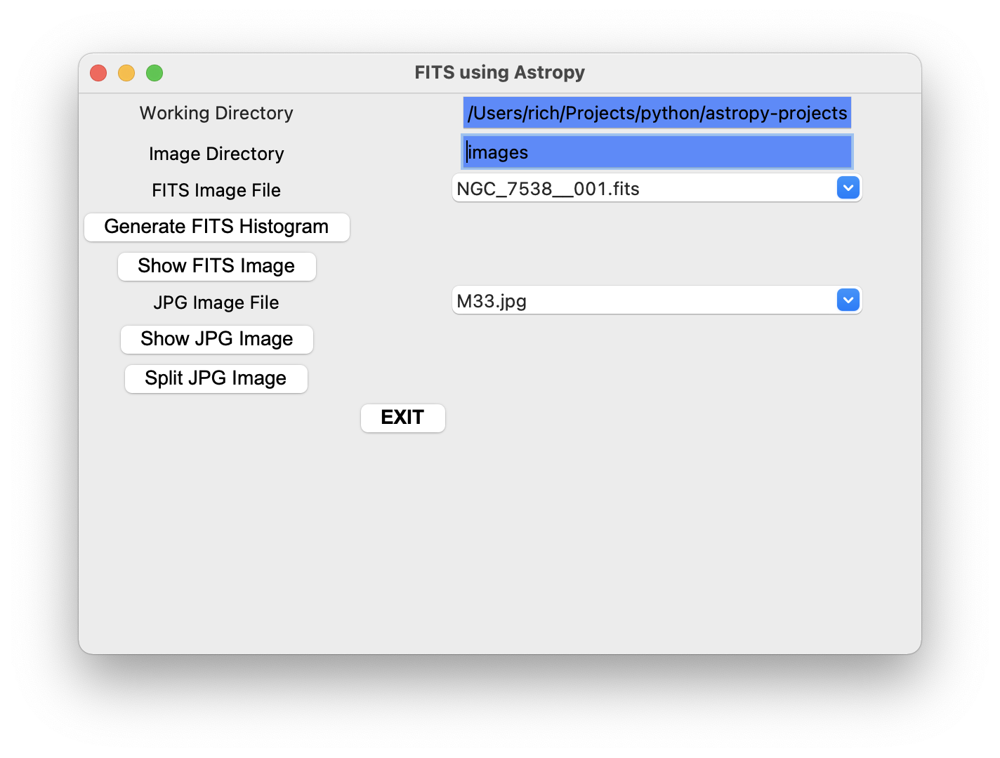

# Project Name
<!--
> Outline a brief description of your project.
> Live demo [_here_](https://www.example.com). <!-- If you have the project hosted somewhere, include the link here. -->

FITS utilities using anaconda and astropy

Purpose:
Uses simple gui control panel to select and process FITS and JPG files.

This project in not intended to replace more powerful tools in this class but as a learning aid. See [DS9](https://mac.softpedia.com/get/Math-Scientific/SAOImage-DS9.shtml).

## Table of Contents
* [General Info](#general-information)
* [Technologies Used](#technologies-used)
* [Features](#features)
* [Screenshots](#screenshots)
* [Setup](#setup)
* [Usage](#usage)
* [Notes](#notes)
* [Source Files](#source-files)
* [Project Status](#project-status)
* [Room for Improvement](#room-for-improvement)
* [Acknowledgements](#acknowledgements)
* [Contact](#contact)
* [License](#license)
* [Copyright](#copyright)

## General Information
- Q: What is it? A: User interactive program intended to allow exploration of astrophotography FITS files.
- Q: What is the goal? A: The overall goal is to have a custom FITS post-processing tool usable in the field.
- Q: What problem does it (intend to) solve? A: Provide visual and transformed data about FITS images for debugging and _learning_ FITS post-processing.
- Q: What is the purpose of your project? A:  An expandable tool useful for post-processing FITS images in the field. Just add more gui and functional callbacks.
- Q: Why did you undertake it? A:  I want to see colorful images in the field and have something to do during long exposures.

## Technologies Used

### Highly Recommended
- anaconda - python environment with packages installed
- atom with script - editor

### Required
- anaconda - python environment with packages installed (optional)
- astropy - astrophotography library
- tkinter - GUI
- matplotlib - MATLAB-like plotters
- PIL - picture library
- os - directory and files
- re - pattern matching

### Optional
- MacOS 12.0.1

## Features
List the ready features here:
- histogram plot with save
- image plot with save
- JPG split into FITS with save

## Screenshots

<!-- If you have screenshots you'd like to share, include them here. -->

## Setup
<!-- What are the project requirements/dependencies? Where are they listed? A requirements.txt or a Pipfile.lock file perhaps? Where is it located?

Proceed to describe how to install / setup one's local environment / get started with the project. -->
1. Install anaconda
2. Install atom with, at least, script
3. Clone repository for project source files and images directory.

Use the detailed installation instructions at [Astropy Installation](https://docs.astropy.org/en/stable/install.html).

## Usage
<!-- How does one go about using it?
Provide various use cases and code examples here.

`write-your-code-here` -->

1. Open clone in atom.
2. Select main.py.
3. Run.  Use cmd-i in atom or "> python main.py".
4. Check the directory paths in the GUI.
5. Use GUI to select image files and operations.
6. Look for INFO: and ERROR: messages in terminal.

## Notes
- This program uses the "images" directory for image files (or tries to).

## Source Files
- main.py - main program
- gui.py - control panel
- fits_plotters.py - fits file plotters as callbacks
- rgb_plotters.py - jpg file plotters as callbacks

## Project Status
Project is: *_in progress_* (/ _complete_ / _no longer being worked on_).

<!--If you are no longer working on it, provide reasons why. -->

## Room for Improvement
<!-- Include areas you believe need improvement / could be improved. Also add TODOs for future development.

Room for improvement:
- Improvement to be done 1
- Improvement to be done 2

To do:
- Feature to be added 1
- Feature to be added 2 -->

Improvement:
- GUI is clunky
- Hard to select image files not in images directory
- Add more color processing

To do:
- Fix directory text box change doesn't update files combobox
- More post-processing capabilities

## Acknowledgements
<!-- Give credit here. -->
- This project was inspired by not wanting to spend $ on a real post-processing tool and learning how to post-process.
- This project was based on [this tutorial]
(https://whitaker.physics.uconn.edu/wp-content/uploads/sites/2038/2017/02/PythonTutorial_Metivier.pdf).
- Many thanks to those Open Sourcers and individual contributors for tools and examples.

## Contact
Created by [@karstdiver](https://www..../) - feel free to contact me!

<!-- Optional -->
## License
This project is open source and available under the MIT License.

## Copyright
Copyright (c) 2021 Karst Diver

<!-- You don't have to include all sections - just the one's relevant to your project -->
